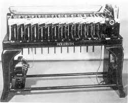
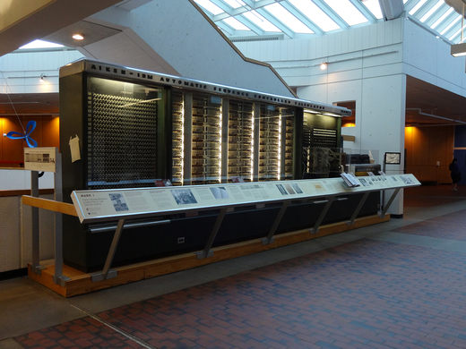

<!-- $theme: gaia -->

# Lógica de ==Programação==

### Aula 1 && 2
###### Antônio Sérgio de Sousa Vieira
###### Curso Técnico Integrado em Informática
###### IFCE campus Itapipoca
### Julho de 2019
###### :email: sergio.vieira@ifce.edu.br

---
# Considerações Iniciais
- Disciplina de 120 horas
	- **60 horas** de teoria
	- **60 horas** de prática
<!--
- Notas
	- **N1.1** - Avaliação Contínua - **N1.2** - Prova
	- **N2.1** - Avaliação Contínua - **N2.2** - Prova
-->
---
# Considerações Iniciais
- Horário de Atendimento ao Estudante

# `Quarta: 14:45 - 18:00`
    
---
# Como obter sucesso na disciplina?

1. ==Estude== pelo menos `4 horas` por semana :books:
2. ==Exponha== suas dúvidas e ==participe== das aulas respondendo as avaliações contínuas :exclamation::question:
3. ==Repita== em `casa` :house: os exemplos discutidos na sala de aula :school:
4. Tente `resolver` os exercícios ==sozinho== :sunglasses:

---
# Objetivos
- Diferenciar computação de informática
- Entender sobre Entrada de Dados, Processamento e Saída de Dados
- Aprender sobre a evolução dos computadores

---
# Computação versus Informática
<!-- page_number: true -->

- **Informática**
	- Termo utilizado para designar um grande conjunto de ==**conhecimentos**== relativos ao:
		- Armazenamento
		- Processamento
		- Coleta
		- Transmissão/Recepção de informação digital
---
# Armazenamento
- Relacionado aos Sistemas de Backup e recuperação de dados

<small> Qnap TS-431P Storage NAS com 4 baias , até 40 TB</small>

---
# Armazenamento
- Relacionado a computação em nuvem
	- fornecimento de serviço de computação: 
		- servidores, armazenamento de arquivos, banco de dados, rede, I.A etc através da Internet para oferecer invações tecnológicas a um baixo custo.

---
# Armazenamento

---
# Processamento
- Relacionada a utilização de softwares específicos para transformar dado bruto em informação útil.
	- Exemplo:
		- Sistema de previsão de inundação
		- Dados Bruto: Série temporal de precipitação
		- Processamento: Modelo chuva-vazão
		- Informação útil: O reservatório de água vai transbordar?

---
# Coleta
- Relacionado a obtenção de dados

<small>Coleta informações de diversas lojas on-lines para comparar preços de produtos</small>

---
# Transmissão/Recepção de Dados
- Relacionado a redes de computadores
	- Internet
		- Navegadores (Firefox, Chrome, Edge etc)
		- Envio/Leitura de Emails
		- Troca de mensagens através do WhatsApp, Telegram etc

---
# Computação versus Informática
- **Computação**
	- Busca de uma solução para um problema (saída - output), a partir de entrada de dados (inputs).
	

---
# Computação versus Informática

---
# Teste seus conhecimentos!!!
<!-- *template: invert -->

---
# Computador como máquina programável?
- Capaz de realizar uma grande variedade de tarefas, seguindo uma **sequência de comandos**, de acordo com o que for **especificado**.

# `O computador apenas faz o que lhe foi ordenado fazer`

---
# Fundamentos da Computação
- A primeira máquina programável
	- O `tear de Jacquard`
		- Joseph Marie Jacquard
		- Surgiu em 1801 na França
		- Foi financiado pelo governo de Napoleão Bonaparte para recostruir o país após a revolução francesa

---
# Fundamentos da Computação
- A primeira máquina programável
	- O `tear de Jacquard`

---
# Fundamentos da Computação
- O tear de Jacquard
	- Através de cartões perfurados, o tear reproduzia no tecido o desenho **programado**

---
# Fundamentos da Computação

---
# Fundamentos da Computação

[Funcionamento do tear de jacquard](./images/tear-jacquard.mp4)

---
# Teste seus conhecimentos!!!
<!-- *template: invert -->

---
# Fundamentos da Computação
- A máquina diferencial (1822) e a máquina analítica (1833)
    - Charles Babbage
    - Para muitos ele é considerado o **pai do computador**
    - **Máquina Diferencial**: calcular e imprimir extensas tabelas científicas

---
# Fundamentos da Computação
- A máquina diferencial (1822) e a máquina analítica (1833)
    - **Máquina Analítica**: foi concebida não apenas para solucionar um tipo de problema matemático mas para executar uma ampla gama de tarefas de cálculo, de acordo com instruções fornecidas por seu operador
    - Primeiro computador
    - Cartões perfurados

---
# Fundamentos da Computação
- **Augusta Ada Byron**
	- A primeira pessoa a programar um computador foi uma mulher

---
# Teste seus conhecimentos!!!
<!-- *template: invert -->

---
# Fundamentos da Computação
- **Hollerith**
	- Os dados do censo (que ocorre a cada 10 anos) de 1880 dos EUA levou quase 8 anos para ser processado
	- Temia-se que os dados do censo de 1890 não estivessem processados em 1900

---
# Fundamentos da Computação
- **Hollerith**
	- Herman Hollerith (estatístico) foi encarregado pela Agência Estatística dos EUA de desenvolver uma técnica para acelerar o processamento dos dados do censo 
	- Hollerith usou a idéia de Jacquard e construiu a Perfuradora de Cartões 

---
# Fundamentos da Computação
- **Hollerith**
	os dados eram perfurados em cartões que podiam ser classificados por meio de pinos que passavam pelos furos

---
# Fundamentos da Computação

---
# Fundamentos da Computação
- **Tabuladora de Cartões**

- O processamento dos dados do censo de 1890 demorou 3 anos

---
# Fundamentos da Computação
- **Tabuladora de Cartões**
	- vários países utilizaram a máquina
	- Hollerith montou uma empresa “Tabulating Machine Company” - 1924 International Business Machines Corporation - IBM

---
# Fundamentos da Computação
- **Calculadoras**
	- Décadas de 1930 e 1940: os “Anos Efervescentes”
	- Vários projetos simultâneos:
	- Konrad Zuse
		- 1936-1938 surge o Z1
		- 1941 é concluído o Z3, primeira calculadora
universal controlada por um programa

---
# Fundamentos da Computação
- **Calculadoras**
	- Z3: utilizado para projetar aviões e mísseis

---
# Fundamentos da Computação
- **Calculadoras**
	- Howard Aiken
		- 1937-1944 Harvard Mark 1
		- Medidas: 16,6m X 2,6m
		- Peso: 5t e várias toneladas de gelo para refrigeração

---
# Fundamentos da Computação

<small>Mark I</small>

---
# Fundamentos da Computação

<small>Homem de Ferro - Mark I</small>

---
# Fundamentos da Computação
- **COLOSSUS - 1943**
	- Desenvolvida pelos britânicos
	- Possuía dimensões gigantescas: 1.500 válvulas e era capaz de processar cerca de 5.000 caracteres por segundo.
	- Criado com a finalidade de decifrar os códigos secretos usados pelo exército alemão na II Guerra Mundial.

---
# Fundamentos da Computação
- **COLOSSUS - 1943**
	- O interesse pela construção do primeiro computador foi grande, seu interesse inicial era militar. 
	- Alemanha e E.U.A disputavam uma acirrada corrida contra o tempo.

---
# Fundamentos da Computação
- **COLOSSUS - 1943**

---
# Fundamentos da Computação
- **ENIAC (Eletronic Integrator and Calculator)**
	- Levou 3 anos para ser construída: 1943 -1946
	- Consumiu uma pequena fortuna: $500,000 da época
	- Ocupava uma área de 150 $m^2$ e pesava 30 toneladas.

---
# Fundamentos da Computação
- **ENIAC (Eletronic Integrator and Calculator)**
	- Era acionada por um motor equivalente a dois potentes motores de carros de quatro cilindros, enquanto um enorme ventilador refrigerava o
calor produzido pelas válvulas. 
	- Consumia 150.000 watts ao produzir o calor equivalente a 50 aquecedores domésticos.

---
# Fundamentos da Computação
- **ENIAC (Eletronic Integrator and Calculator)**
	- Apesar de não possuir armazenamento e ter sido superado em poder em pouco tempo, o Eniac, em seu tempo de vida, conseguiu realizar mais cálculos do que a humanidade em toda a sua história anterior àquele ponto
	-  385 operações de multiplicação por segundo

---
# Fundamentos da Computação
- **ENIAC (Eletronic Integrator and Calculator)**

---
# Fundamentos da Computação

<small>Processamento maior que o do ENIAC</small>

---
# Fundamentos da Computação
[Mulheres programando o ENIAC](./images/eniac.mp4)

---
# Teste seus conhecimentos!!!
<!-- *template: invert -->

