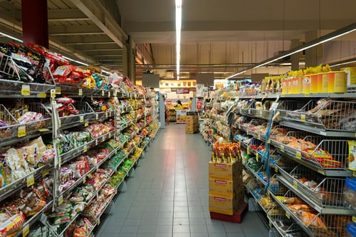
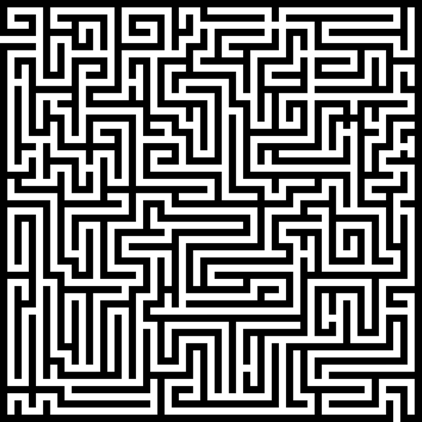

<!-- $theme: gaia -->

# Lógica de ==Programação==

### Aula 3 && 4
###### Antônio Sérgio de Sousa Vieira
###### Curso Técnico Integrado em Informática
###### IFCE campus Itapipoca
### Julho de 2019
###### :email: sergio.vieira@ifce.edu.br

---
# Objetivos da Aula

1. Apresentar os ==conceitos de lógica== e sua aplicação no cotidiano.
2. Definir ==algoritmo==.
3. Estabelecer uma ==relação entre lógica e algoritmo==: a lógica de programação.
4. Exemplificar a aplicação dos algoritmos utilizando ==situações do dia-a-dia==.
5. Elencar as ==principais formas de representação dos algoritmos==.

---
<!-- page_number: true -->

# Introdução - ==O que é Lógica==?

---
## O que é lógica?
* A lógica esta relacionada à ==racionalidade==
* Ela não esta apenas relacionada a matemática mas também a ==outras ciências== e ao dia-a-dia das pessoas
* Lógica é a arte de ==pensar bem== e ela estuda a ==correção do raciocínio==


---
## O que é lógica?
Exemplos de Lógica Proposicional (Matemática):
1. 	Todo mamífero é um animal
	Todo cavalo é um mamífero
    Portanto, ==(O que podemos deduzir?)==

---
## O que é lógica
Exemplos de Lógica Proposicional (Matemática):
1. 	Todo mamífero é um animal
	Todo cavalo é um mamífero
    Portanto, todo cavalo é um animal


---
## Lógica no dia-a-dia

* Em nosso cotidiano, quando queremos pensar, falar, escrever ou agir corretamente, precisamos colocar ==ordem no pensamento==, ou seja, utilizar **lógica**.

==**Exemplo 1**==:
Objetivo:Pegar uma caneta dentro de uma gaveta
1. 	A gaveta esta fechada
	A caneta esta dentro da gaveta
    Precisamos abrir a gaveta para depois pegar a caneta

---
## Lógica no dia-a-dia
==**Exemplo 2**==:
* Para formar uma frase coerente, é preciso realizar pensamentos lógicos para ordenar as letras, sílabas, palavras, para que quem esteja ouvindo entenda perfeitamente.

```
// A lógica de programação é bastante útil
````

```
// 7 se parabéns frente ao de qual 
```
---
## Lógica no dia-a-dia
==**Exemplo 3**==:
- Pode-se utilizar da lógica para se movimentar pelos corredores de um supermercado na sequência correta para pegar os produtos sem ter que perder muito tempo.



---
## Lógica no dia-a-dia
- Quando usamos o raciocínio para tomar uma decisão, buscamos sempre a saída mais lógica, ou seja, a opção que nos pareça ser a mais adequada para resolver um problema ou atingir um objetivo



---
## Lógica no dia-a-dia
Descreva logicamente as ações necessárias para:

**a)** 	==**Trocar uma lâmpada**==

---
## Lógica no dia-a-dia
Descreva logicamente as ações necessárias para:

**b)** ==**Tirar uma self**==

---
# Lógica de Programação


---
## Lógica de programação
- É o uso correto do pensamento lógico na programação de computadores.


---
## Lógica de programação
- O ser humano pode representar uma infinidade de ideias em diferentes idiomas.
	* Olá (==Português==)
	* Tungjatjeta (==Albanês==)
	* Salam (==Azerbaijano==)
	* Goedendag (==Holandês==)
---
## Lógica de programação
- O mesmo ocorre através da lógica de programação
- Uma ideia pode ser representada em diversas linguagens de programação existentes

```
// C
main() { printf("alô, mundo\n");}
```
```
// Basic
10 PRINT "alô, mundo"
```

---
## Lógica de programação
- O ==objetivo principal== da estudo da lógica de programação e a **construção de algoritmos coerentes e válidos**

---
## O que é um algoritmo?
### É uma ==sequência finita e organizada== de passos que visam a atingir um ==objetivo bem definido==


---
## O que é um algoritmo?
- Quando criamos um algoritmo
	- Devemos especificar `ações claras` e `precisas`
	- E é a partir de um ==estado inicial==, feitas algumas ==ações==, espera-se chegar em um ==estado final== de forma a atingir o `objetivo` pretendido.,
- Um algoritmo é lido `sequencialmente`, de ==cima para baixo== e da ==direita para a esquerda==, como em um livro.
---
## O que é um algoritmo?
==**Exemplo 4**==:
```html
 Algoritmo Atravessar a rua
   Olhar para a direita
   Olhar para a esquerda
   Se estiver vindo carro
     Não atravesse 
   Senão
     Atravesse
   Fim-Se
 Fim-Algoritmo
```

---
## O que é um algoritmo?
==**Exemplo 5**==:
```html
   Algoritmo Calcular a média entre dois números
     Informe o primeiro número (x1)
     Informe o segundo número (x2)
     A média é igual a
 ```

$$\frac{x_1 + x_2}{2}$$

```html
     Escrever o valor da média
   Fim-Algoritmo
```

---
## O que é um algoritmo?
Descreva um algoritmo para:

**c)** 	==**Calcular a média ponderada entre duas notas (pesos 3 e 2)**==

**Fórmula**
$$\frac{3x_1 + 2x_2}{5}$$

---
## O que é um algoritmo?
Descreva um algoritmo para:

**d)** 	==**Modifique o algoritmo criado no exercício c) incluindo a seguinte condição:**==
> Escreva `Aprovado` :sunglasses: quando a média for maior ou igual a ==6== ou `Reprovado` :sob: caso contrário

---
## Exercícios de Fixação
I) Três senhoras - dona Branca, dona Rosa e dona Violeta - passeavam pelo parque quando dona Rosa disse:
- Não é curioso que estejamos usando vestidos de cores brancas, rosa e violeta, embora nehuma de nós esteja usando um vestido de cor igual ao seu próprio nome?
- Uma simples coincidência - respondeu a senhora com o vestido violeta.

**Qual a cor do vestido de cada senhora?**

---
## Exercícios de Fixação
I) Três senhoras - dona Branca, dona Rosa e dona Violeta - passeavam pelo parque quando dona Rosa disse:
- Não é curioso que estejamos usando vestidos de cores brancas, rosa e violeta, embora nehuma de nós esteja usando um vestido de cor igual ao seu próprio nome?
- Uma simples coincidência - respondeu a senhora com o vestido violeta.

**Qual a cor do vestido de cada senhora?**

---
## Conceitos exemplos de algoritmos


---
## Noções de fluxo de controle
