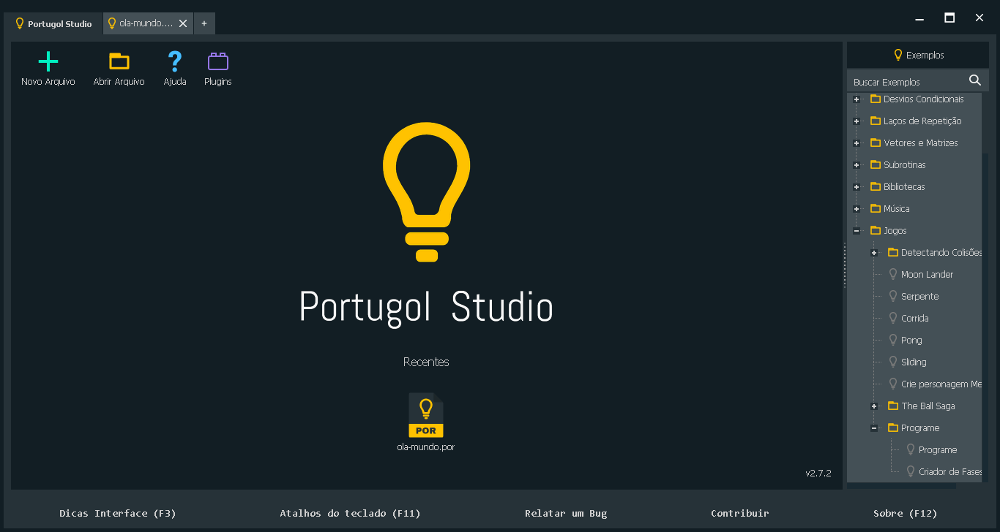

<!-- $theme: gaia -->

# Lógica de ==Programação==

### Aula 5 && 6
###### Antônio Sérgio de Sousa Vieira
###### Curso Técnico Integrado em Informática
###### IFCE campus Itapipoca
### Agosto de 2019
###### :email: sergio.vieira@ifce.edu.br

---
# Objetivos da Aula
1. Conhecer o ambiente de desenvolvimento Portugol Studio
2. A estrutura básica do código fonte no Portugol Studio
3. Definição de Variáveis
4. Tipos de Variáveis
5. Tipos de Algoritmos (Descrição Narrativa, Fluxograma e pseudocódigo)

---
<!-- page_number: true --> 
# Conhecendo o Portugol Studio


---
# Conhecendo o Portugol Studio
- Seu primeiro programa :smile:
``` 
programa { 
  funcao inicio () { 
    inteiro numero
    escreva("Digite um número inteiro: ")
    leia(numero)
    escreva("O número digitado foi: ", numero, "\n")
  } 
}
```

---
# Conhecendo o Portugol Studio
- Seu segundo programa :smile:
```
programa {
  funcao inicio() {
    inteiro nota_1 = 10
    inteiro nota_2 = 5
    inteiro media = (nota_1 + nota_2) / 2
    escreva("Sua média inteira vale = ", media, "\n")
  }
}
```

---
# Conhecendo o Portugol Studio
- Seu terceiro programa :smile:
```
programa {
  funcao inicio() {
    inteiro nota_1 = 10
    inteiro nota_2 = 5
    real media = (3 * nota_1 + 2 * nota_2) / (3 + 2)
    escreva("Sua média ponderada vale = ", media, "\n")
  }
}
```

---
# Método para construção de algoritmo
- Passos
	1. Compreender completamente o problema a ser resolvido
	2. Definir os dados de entrada
	3. Definir o processamento
	4. Definir os dados de saída
	5. Construir o algoritmo
	6. Testar

---
# Tipos de Algoritmo
1. Descrição Narrativa: descreve a solução do problema utilizando linguagem natural
- **Vantagem**: não é necessário aprender nenhum conceito novo
- **Desvantagem**: a língua natural pode abrir espaço para várias interpretações podendo dificultar a codificação do algoritmo

---
# Tipos de Algoritmo
2. Fluxograma: descreve a solução do problema utilizando símbolos gráficos
- **Vantagem**: os símbolos gráficos são mais simples de entender
- **Desvantagem**: é necessário aprender a simbologia dos fluxogramas. Podem possuir poucos detalhes.

---
# Tipos de Algoritmo


---
# Tipos de Algoritmo
3. Pseudocódigo: descreve por meio de regras prédefinidas os passos a serem seguidos para a resolução do problema.
- **Vantagem**: a passagem do algoritmo para uma linguagem de programação é mais simples
- **Desvantagem**: é necessário aprender um conjunto de regras para descrever o pseudocódigo corretamente

---
# Variável
- No desenvolvimento de algoritmos é muito importante guardar algumas informações.
- Essas informações podem ser utilizadas na resolução do problema.
- Uma variável é uma forma de armazenar tais informações.
- O Conteúdo de uma variável pode ser modificado, consultado ou apagados quantas vezes for necessário.

---
## `Uma variável é um espaço na memória principal do computador que pode conter diferentes valores a cada instante de tempo (LOPES;GARCIA, 2002).` 

---
# Tipos de Variável
- **inteiro**: Uma variável do tipo inteiro pode ser entendida como uma variável que contém qualquer número que pertença ao conjunto dos números inteiros. Podem ser positivos, negativos ou nulos.
- **real**: armazena um número real como uma fração decimal possivelmente*infinita, como o número PI 3.1415926535. Os valores do tipo de dado *real* são números separados por pontos e não por virgulas

---
# Tipos de Variável
- **cadeia**:  é uma sequência ordenada de caracteres (símbolos) escolhidos a partir de um conjunto pré-determinado.

```
programa
{
  funcao inicio()
  {
    cadeia nome = "Sergio"
    cadeia sobrenome = "Vieira"
    cadeia nome_completo = nome + " " + sobrenome
    escreva(nome_completo)
  }
}
```

---
# Tipos de Variável
- **caracter**: é aquela que contém uma informação composta de apenas UM carácter alfanumérico ou especial. Exemplos de caracteres são letras, números, pontuações e etc

```
programa
{
  funcao inicio()
  {
    caracter letra1 = 'A'
    caracter letra2 = 'B'
    escreva(letra1, " ", letra2)
  }
}
```

---
# Tipos de Variável
- **logico**: é aquela que contém um tipo de dado, usado em operações lógicas, que possui somente dois valores, que são consideradas pelo Portugol como verdadeiro e falso


---
# Tipos de Variável
```
programa
{
  funcao inicio()
  {
    logico valor_logico = verdadeiro
    se (valor_logico == verdadeiro)
    {
      escreva("Verdade")
    }
    senao
    {
      escreva("Falsidade")
    }
  }
}
```

---
# Declaração de Variável
- As variáveis podem ser entendidas como sendo apelidos para as posições de memória. 
- É através das variáveis que os dados dos nossos programas serão armazenados. 
- A sintaxe para se declarar uma variável é o **tipo da variável**, o **nome da variável** ou das variáveis (separadas por virgula cada uma) e opcionalmente pode ser atribuído a ela um valor de inicialização (==exceto se for declarado mais de uma na mesma linha==)

---
# Declaração de Variável
- Nome válido
	- Inicializado por letra (a-z) ou _
		- Seguido por _, numero, 
	- Case sensitive (sensível ao caso)
	- Não pode-se usar palavras reservadas como nome das variáveis

---
# Comando Escreva
- O comando escreva é utilizado quando deseja-se mostrar informações no console da IDE, ou seja, é um comando de saída de dados.
- Para utilizar o comando escreva, você deverá escrever este comando e entre parênteses colocar a(s) variável(eis) ou texto que você quer mostrar no console. 
- Lembrando que quando você utilizar textos, o texto deve estar entre aspas.

---
# Comando Escreva
- Caractere especiais
	- **\n (Nova linha)**
	- **\t (Tabulação)**

---
# Comando Leia
- O Comando leia é utilizado quando se deseja obter informações do teclado do computador, ou seja, é um comando de entrada de dados. Esse comando aguarda um valor aser digitado e o atribui diretamente na variável.
```
inteiro x
cadeia y
real z

escreva("Digite um valor para x: ")
leia(x)
escreva("Digite um valor para y: ")
leia(y)
```

---
# Exercício 01
- Faça um algoritmo no Portugol Studio para mostrar o resultado da multiplicação de dois números.

---
# Exercício 01
- Faça um algoritmo no Portugol Studio para ler seu nome a partir do teclado e sua idade e exiba-os no console da seguinte forma.

# `Olá <variável nome>, atualmente você tem <variável idade> anos de idade`

