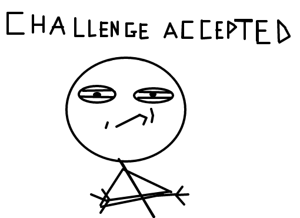

<!-- $theme: gaia -->

# Lógica de ==Programação==

### Aula 7 && 8
###### Antônio Sérgio de Sousa Vieira
###### Curso Técnico Integrado em Informática
###### IFCE campus Itapipoca
### Agosto de 2019
###### :email: sergio.vieira@ifce.edu.br

---
# Objetivos da Aula
1. Operadores Aritméticos
2. Operadores Relacionais
3. Operadores Lógicos
6. Tabela verdade e as operações NOT e AND

---
<!-- page_number: true -->
# Operadores Aritméticos
| Operação | Operador Portugol | Prioridade |
| - | - | - |
| Soma | a + b |  4 |
| Subtração | a - b | 4 |
| Multiplicação | a * b | 3 |
| Divisão | a / b | 3 |
| Divisão Inteira | a / b (a e b inteiros) | 3 |
| Exponenciação | Matematica.potencia(a, b) | 2 |
| Resto | a % b | 3 |

---
# Operadores Aritméticos
```
programa {
  inclua biblioteca Matematica --> mat
  funcao inicio() {
    inteiro a = 15
    inteiro b = 2
    real a_ = 2
    real b_ = 2
    escreva("Soma: ", a + b, '\n')
    escreva("Subtração: ", a - b, '\n')
    escreva("Multiplicação: ", a * b, '\n')
    escreva("Divisão: ", a / b_, '\n')
    escreva("Divisão Inteira: ", a / b, '\n')
    escreva("Exponenciação: ", mat.potencia(a_, b_), '\n')
    escreva("Resto: ", a % b, '\n')
  }
}
```

---
# Operadores Aritméticos
- Qual o resultado das expressões?

```
programa {
  inclua biblioteca Matematica --> mat
  funcao inicio() {
    escreva(2 * 5 + 3, '\n')
    escreva(2 - 5 + 3, '\n')
    escreva(2 + 5 - 3, '\n')
    escreva(20 / 5 * 2, '\n')
    escreva(20 * 5 / 2, '\n')
    escreva(20 * 20 / mat.potencia(2.0, 2.0), '\n')
    escreva(20 / 20 * mat.potencia(2.0, 2.0), '\n')
  }
}
```
---
# Teste seus conhecimentos!!!
<!-- *template: invert -->


---
# Desafio de Programação I
**Escreva um algoritmo que calcule a área de um triângulo.**

==**Objetivo do algoritmo**==: calcular a área de triângulo.
==**Entrada**==: obter o valor da base e da altura do triângulo.
==**Processamento**==: calcular o valor da área do triângulo.

$area = \frac{base \cdot altura}{2}$

==**Saída**==: imprimir o valor da área. 

---
# Desafio de Programação II
**Escreva um algoritmo que calcule a área e o perímetro de um círculo.**

==**Objetivo do algoritmo**==: calcular a área e o perímetro de um círculo.
==**Entrada**==: ler o valor do raio.
==**Processamento**==: calcular a área que é dada por: e perímetro que é dado por

$area = \pi \cdot r^2$
$perimetro = 2 \cdot \pi \cdot r$

==**Saída**==: imprimir o valor da área e do perímetro

---
# Operadores Relacionais
| Operação | Operador Portugol |
| - | - | - |
| Igualdade | a == b | 
| Diferença | a != b |
| Maior que | a > b |
| Menor que | a < b |
| Maior ou igual a| a >= b |
| Menor ou igual a | a <= b |

---
# Operadores Relacionais
```
programa {
  funcao inicio() {
    inteiro x = 5, y = 10
    escreva(x > y, '\n')
    escreva(x < y, '\n')
    escreva(x >= y, '\n')
    escreva(x <= y, '\n')
    escreva(x == y, '\n')
    escreva(x != y, '\n')
  }
}
```

---
# Operadores Lógicos
| Operação | Operador Portugol | Inglês
| - | - | - |
| Disjunção | a ou b | a or b |
| Conjunção | a e b | a and b |
| Negação | nao a | not a |

---
# Operadores Lógicos
```
programa {
  funcao inicio() {
    logico x = verdadeiro, y = falso
    escreva(x ou y, '\n')
    escreva(x e y, '\n')
    escreva(nao x, '\n')
    escreva(nao y, '\n')
  }
}
```

---
# Tabela Verdade
- **Disjunção (OU)**

| a | b | a ou b |
| - | - | - |
| V | V | V |
| V | F | V |
| F | V | V |
| F | F | F |

---
# Tabela Verdade
- **Conjunção (E)**

| a | b | a e b |
| - | - | - |
| V | V | V |
| V | F | F |
| F | V | F |
| F | F | F |

---
# Tabela Verdade
- **Negação (nao)**

| a | nao a|
| - | - |
| V | F |
| F | V |

---
# Estruturas de Controle
- Em determinadas situações é necessário **executar ações de acordo com os dados fornecidos pelo programa**.
- Nestas situações os ==operadores relacionais== e ==lógicos== são fundamentais
- ==**Estruturas de controle (ou fluxos de controle)**== referem-se à ordem em que **instruções**, **expressões** e **chamadas de função** são executadas

---
# Estruturas de Controle
- Sem o uso de estruturas de controle, o programa seria executado de cima para baixo, instrução por instrução, dificultando assim a resolução de diversos problemas.
- Nas estruturas de controle temos:
	- ==Estruturas Condicionais==
		- Simples
		- Composta
	- ==Laços de Repetição==

---
# Desvios Condicionais
- Estrutura condicional **simples**
	- a ação só será executada se a expressão for verdadeira

# ==se (==*expressão verdadeira*==)== *ação*

- A expressão verdadeira é obtida através dos ==**operadores relacionais**== e ==**lógicos**==

---
# Estrutura condicional simples
- Como será executada apenas uma ação, ==não é necessário utilizar as chaves==
```
programa
{
  funcao inicio()
  {
    se (10 > 4) escreva("10 é maior que 4")
  }
}
```

---
# Estrutura condicional simples
- Neste exemplo, como devem ser executadas mais que uma ação, ==as chaves são necessárias==
```
programa
{
  funcao inicio()
  {
    se (10 > 4) {
      escreva("10 é maior que 4\n")
      escreva("Outra linha...")
    }
  }
}
```

---
# Estrutura condicional composta
- Na estrutura condicional composta, ==uma ação é executada quando a expressão for **verdadeira**== e ==outra ação quando for **falsa**==.

# ==se (==*expressão verdadeira*==)== =={== *ação 1* ==}== senao =={== ação 2 ==}==

---
# Estrutura condicional composta
```
programa
{
  funcao inicio()
  {
    logico valor1 = verdadeiro
    logico valor2 = falso
    se (valor1 ou valor2) {
      escreva("Ação 1 é executada!")
    } senao {
      escreva("Ação 2 é executada!")
    }
  }
}
```

---
# Estrutura condicional aninhada
- Existem algumas situações onde mais de duas expressões devem ser avaliadas para contemplar todos os casos possíveis.
- ==Exemplo==:
	- Identificar quando um número for maior, menor ou igual a outro

---
## Estrutura condicional aninhada
```
programa
{
  funcao inicio()
  {
    inteiro valor1, valor2
    escreva("Digite o primeiro valor:")
    leia(valor1)
    escreva("Digite o segundo valor:")
    leia(valor2)
    se (valor1 < valor2) {
      escreva(valor1, " é menor que ", valor2)
    } senao se (valor1 > valor2) {
      escreva(valor1, " é maior que ", valor2)
    } senao escreva(valor1, " é igual a ", valor2)    
  }
}
```

---
# Desafio de Programação III
**Escreva um algoritmo leia um número informado e diga se ele é par ou ímpar.**

==**Objetivo do algoritmo**==: identificar se um número é par ou ímpar.
==**Entrada**==: ler o número.
==**Processamento**==: identificar se ele é par ou ímpar utilizando %

$se 10 % 2 for igual a zero o número é par caso contrário ele é ímpar$

==**Saída**==: imprimir se o número é par ou ímpar


---
# Resposta - Binário para Decimal
