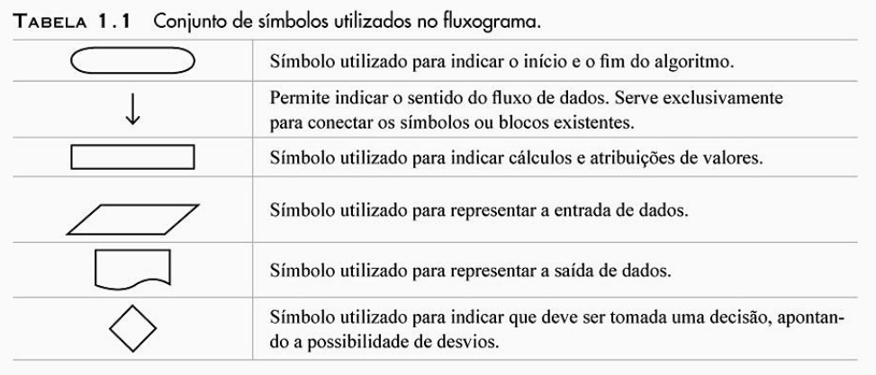
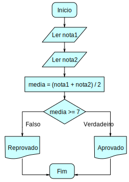
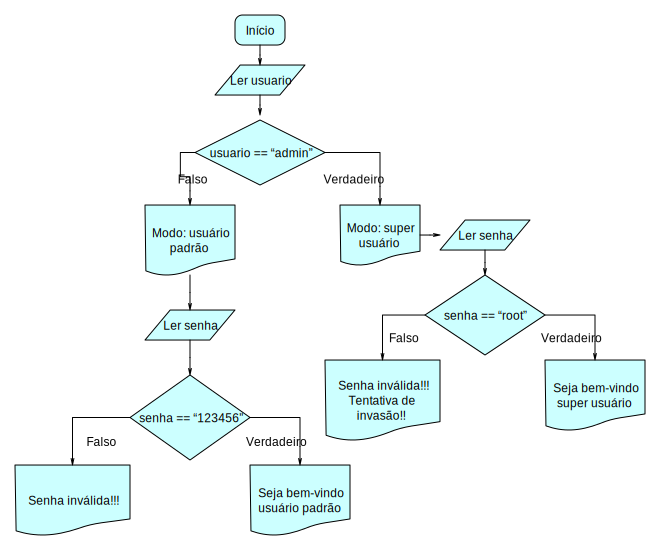
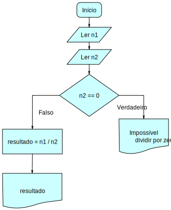

<!-- $theme: gaia -->

# Lógica de ==Programação==

### Aula 9 && 10
###### Antônio Sérgio de Sousa Vieira
###### Curso Técnico Integrado em Informática
###### IFCE campus Itapipoca
### Agosto de 2019
###### :email: sergio.vieira@ifce.edu.br

---
# Objetivos da Aula
1. Praticar conversão de fluxograma para algoritmo Portugol
1. Aprender sobre o desvio condicional Escolha Caso

---
<!-- page_number: true -->
# Fluxograma

---
# Fluxograma - Exemplo 1

---
# Fluxograma - Exemplo 2

---
# Fluxograma

---
# Desvio Condicional
- Escolha Caso
	- Em algumas situações a quantidade de escolhas pode ser muito grande
	- Podemos ainda utilizar o comando **se** para verificar cada situação
	- Porém, existe uma estrutura que lida melhor com tal situação
	- É o caso do comando ==Escolha caso==

---
# ==escolha(== opção ==) {==	
# ==caso== 1: *ação 1* ==pare==
# ==caso== 2: *ação 2* ==pare==
# ==caso contrario==: *última ação*
# ==}==

---
# Escolha Condicional
- Exemplo ==**Escolha Caso**==

---
